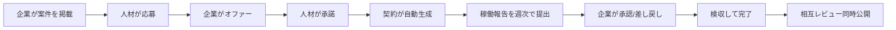

# Tsunagu Works

**企業 × IT人材（副業・フリーランスエンジニア）のビジネスマッチングサービス。**

マッチングの本質は「出会わせること」ではなく、**知らない者同士が安心して取引できる仕組み**をつくること。
このプロジェクトは、その「**信頼の設計**」をどう実装するかに焦点を当てている。

> 個人開発・学習目的。仕様と設計判断は [docs/](docs/) に記録している。
> 動かす場合は [セットアップ](#セットアップ)へ。

## 何を解決するか

業務委託のマッチングでは、当事者に4つの不安がある。それぞれに機能を対応させた。

| 不安 | 機能 | 状態 |
| --- | --- | --- |
| 「報酬が支払われないかもしれない」 | **エスクロー決済**（仮払い→検収→支払い） | 🚧 M4 |
| 「プラットフォーム外で取引されてしまう」 | **連絡先マスキング**（メール・電話・URLを伏せる） | ✅ |
| 「働きぶりが見えない / 証拠を残したい」 | **週次の稼働報告**（提出→承認/差し戻し） | ✅ |
| 「悪い評価をつけたら報復されそう」 | **レビュー同時公開**（両者提出まで非公開） | ✅ |

### 実装の要点

**連絡先マスキング** — メッセージ本文からメール・電話・URLを検出して伏せる。
原文はDBに残す（監査・紛争時の証跡）が、**APIは表示用しか返さない**。
完璧な検出は不可能なので「簡単にはできなくする」ことを目標とし、
**誤検知を減らす方向**に倒している（「10時から18時」「2026-08-07」を電話番号と誤認しない）。

**レビュー同時公開** — `submitted_at` と `published_at` を分けるだけで実現している。
片方が提出しても `published_at` は NULL のまま、**2人目が提出した瞬間に両方へ同じ時刻**が入る。
未公開の相手レビューは画面で隠すのではなく、そもそも **SELECT しない**。

**稼働報告** — 週の開始日（月曜）を DATE で持ち、`UNIQUE(contract_id, week_start)` で二重提出を防ぐ。
週の丸めは `date_trunc('week', ...)` で **DB側**が行う（クライアントの週計算を信用しない）。

## 主な機能の流れ



**ダブルオプトイン** — 契約が成立するのは、企業のオファーと人材の承諾が**両方揃ったとき**だけ。
遷移表で「accepted に入れるのは offered から・人材のみ」と定義しており、
企業が単独で契約を成立させることは構造的にできない。

## 設計の見どころ

### 状態遷移を表で一元管理する（5本）

| 対象 | 状態 | 特徴 |
| --- | --- | --- |
| 応募 | 応募済み → オファー → 成立 / 見送り / 取り下げ / 辞退 | **ダブルオプトイン** |
| 案件の掲載 | 下書き ⇄ 公開中 → 募集終了 → 再募集 | 終端が無い |
| 契約 | 成立 → 稼働中 → 検収待ち → 完了 / 中止 | **差し戻し（戻る遷移）** |
| 稼働報告 | 提出 → 承認 / 差し戻し → 再提出 | 承認は終端 |
| レビューの公開 | 提出 → （両者揃うと）公開 | 遷移ではなく**条件判定** |

- 遷移の定義は**コード上の1か所**（`map[遷移]実行者`）にまとめ、判定関数は1つだけ
- **許可だけを列挙**し、表に無い組み合わせは自動的に拒否（ホワイトリスト）
- テストは**全状態 × 全遷移先 × 全ロール**を網羅し、**ケース数の検算**も行う（状態を増やしたときの書き漏れを検出）

### 「できないようにする」より「できる形が存在しない」

| やりたいこと | 実装 |
| --- | --- |
| 二重応募を防ぐ | `UNIQUE(project_id, talent_id)` ＋ **違反を409に翻訳**（事前SELECTしない） |
| 編集で意図せず公開しない | **UPDATE の SET句に status を書かない** |
| 原文を漏らさない | **レスポンス型にフィールドを作らない・SELECTで取らない** |
| 他人のデータを触らせない | **所有チェックを WHERE に埋め込む**（取得してから判定しない） |

### 合意した条件は値でコピーする

契約の単価・案件名は、案件を参照せず**契約側にコピー**して保存する。
案件は後から編集できるため、参照のままだと**契約成立後に単価を書き換えられる**。
`projects.hourly_rate_max`（今の募集条件）と `contracts.hourly_rate`（あのとき合意した条件）は**別の事実**。

## 規模（MVP完成時点・2026-08-07）

| 項目 | 数 |
| --- | --- |
| テーブル | 9（users / companies / talents / projects / applications / contracts / work_reports / messages / reviews） |
| APIエンドポイント | 28 |
| 画面 | 23 |
| Go（実装 / テスト） | 3,948行 / 1,309行 |
| 状態を持つ仕組み | **5本**（応募・掲載状態・契約・稼働報告・レビュー公開） |

テストは**純粋関数**（バリデーション・状態遷移表・マスキング）に絞っている。
DBを使うテストとE2Eは、**後継リポジトリでテスト戦略ごと設計する**方針（[docs/アーキテクチャ.md](docs/アーキテクチャ.md)）。

## 全体構成

```
ブラウザ ── Next.js (App Router / :3000) ── Go API (:8081) ── PostgreSQL (:5434)
```

設計の詳細は各ディレクトリのREADMEへ:

- [api/README.md](api/README.md) — バックエンド設計（構成・規約・選定理由・R1ロードマップ）
- [web/README.md](web/README.md) — フロントエンド設計（ルートグループ・BFF・選定理由・R2/R3ロードマップ）

## 技術スタックと選定理由

| 領域             | 技術                                                   | なぜ選んだか                                                                             |
| ---------------- | ------------------------------------------------------ | ---------------------------------------------------------------------------------------- |
| バックエンド     | **Go 標準 net/http**                                   | Go 1.22+で主要なルーティングが標準化。フレームワークの隠蔽なしに仕組みを学べる・依存ゼロ |
| DBアクセス       | **database/sql + pgx**（ORMなし）                      | SQLとDB挙動を自分で制御・学習対象にする。型安全化はR1でsqlc検討                          |
| マイグレーション | **sql-migrate**                                        | up/down/status の履歴管理。psqlでDDL直接実行は禁止                                       |
| 認証             | **自前JWT（HS256）+ bcrypt + httpOnly Cookie**         | トークンをブラウザJSに触れさせない。alg強制・同一401など攻撃対策を自分の手で実装         |
| フロント         | **Next.js App Router + TypeScript**                    | RSC/Client境界の設計・BFF（Route Handler）を実践                                         |
| API通信          | **REST + 素のfetch**（axios/GraphQL不使用）            | Nextのfetch拡張（キャッシュ）に乗る。GraphQLは規模条件を満たさず不採用（判断ログはdocs） |
| スタイル         | **Tailwind v4 + shadcn/ui**                            | コピーイン方式＝コードを所有。デザイントークンで一括テーマ変更                           |
| テスト           | **go test（テーブル駆動）/ Vitest + Testing Library**  | 「ユーザーから見える振る舞い」でテストする方針                                           |
| CI               | **GitHub Actions**（パスフィルタ・lint/test/build）    | ローカルとCIで同一コマンド・同一設定ファイル                                             |
| 開発体験         | **air / golangci-lint / Prettier / Makefile / Docker** | ホットリロード・品質ゲート・コマンド集約・環境再現性                                     |

## ディレクトリ構成

```
api/            Go バックエンド（フラット構成 → api/README.md）
web/src/        Next.js（→ web/README.md）
  app/          ルーティング（(public)/(guest)/(authenticated) ＝アクセス制御境界）
  components/   UI部品（ui/ は shadcn 生成物）
  lib/          API アクセス層（fetch の唯一の置き場・server/client 分離）
migrations/     DBスキーマ（sql-migrate: ddl/*.sql）＋シード
docs/           設計書・学習ログ・判断ログ
```

## セットアップ

```bash
# 0. 開発ツールのインストール（初回のみ）
go install github.com/rubenv/sql-migrate/...@latest                  # マイグレーション
go install github.com/air-verse/air@latest                           # ホットリロード
go install github.com/golangci/golangci-lint/v2/cmd/golangci-lint@latest  # linter
# ※ ~/go/bin に PATH を通しておくこと

# 1. 環境変数の準備（初回のみ）
cp api/.env.example api/.env         # 必須: DATABASE_URL / JWT_SECRET（任意: PORT / WEB_ORIGIN）
cp web/.env.example web/.env.local   # NEXT_PUBLIC_API_URL を設定

# 2. DB 起動＆スキーマ適用＆シード投入
make db-up
make migrate-up
make seed      # テストユーザー投入（任意・下表参照）

# 3. 開発サーバー起動（別ターミナルで各々）
make dev-api   # Go API（air ホットリロード・:8081）
make dev-web   # Next.js（:3000）
```

その他のコマンドは `make help` で一覧表示（テスト: `make test` / lint: `make lint` / ビルド: `make build`）。

### フルDocker起動（ローカルにGo/Nodeが無くても動く）

```bash
make docker-up   # db + api(air) + web(next dev) を一括起動（初回は依存DLで数分）
make docker-down # 停止
```

- ソースはマウント注入のため、ホストでの編集がそのままホットリロードされる
- ローカル直起動（make dev-api / dev-web）とはポートを取り合うため**同時には使えない**
- DBはどちらのモードでも同じコンテナ・同じデータを共有する

## テストユーザー（make seed で投入・ローカル専用）

| メールアドレス       | パスワード  | ロール |
| -------------------- | ----------- | ------ |
| company1@example.com | password123 | 企業   |
| company2@example.com | password123 | 企業   |
| talent1@example.com  | password123 | 人材   |
| talent2@example.com  | password123 | 人材   |

`make seed` は何度実行しても安全（upsert）。同じ email のユーザーが既にいる場合は上表の資格情報に上書きされる。

### 性能計測用の大量データ

```bash
make seed-large   # 案件を5万件投入（ローカル専用・約2秒）
```

- 掲載元は「シード企業1〜10」の10社、案件は `デモ案件 #00001` 形式の連番
- `random()` を使わず連番から決定的に値を導出しているため、**誰が実行しても同じデータ**（計測の before/after を比較できる）
- 再実行すると生成分だけを作り直す（手動作成した案件は消えない）

## テスト

```bash
# api（Go）
cd api && go test ./...        # 一括実行（-v で詳細・-run 'Test名' で絞り込み）

# web（Vitest + Testing Library）
cd web && npm run test         # 一括実行（CI と同じ）
cd web && npm run test:watch   # 変更を監視して自動再実行（開発時）
```

## Lint / Format

```bash
# api（Go）: golangci-lint（インストール: go install github.com/golangci/golangci-lint/v2/cmd/golangci-lint@latest）
cd api && golangci-lint run ./...

# web（Next.js）: ESLint / Prettier
cd web && npm run lint          # コード品質（ESLint）
cd web && npm run format:check  # 整形チェック（Prettier）
cd web && npm run format        # 一括整形
```

## DBマイグレーション（sql-migrate）

スキーマ変更はすべて `migrations/ddl/*.sql` のマイグレーションで管理します（psql で直接 DDL を流さない）。

```bash
make migrate-up      # 未適用のマイグレーションをすべて適用
make migrate-status  # 適用状況の確認（APPLIED / PENDING）
make migrate-down    # ロールバック：直前の1件だけ巻き戻す
make -C migrations reset   # リセット：全件巻き戻し（全テーブルDROP。ローカル専用）
make migrate-new NAME=create_projects  # 新規マイグレーションの雛形作成
```

- `down` / `reset` は **DROP TABLE によりデータも消えます**。ローカル開発の手直し用で、本番では原則使いません（戻したいときは逆操作の Up を新規作成＝ロールフォワード）
- DBを完全に作り直したい場合: `docker compose down -v && docker compose up -d db && make migrate-up`（`-v` でデータボリュームごと削除）

## 雛形としての利用

認証・BFF・マイグレーション・CI・lint の構成は、**別リポジトリ `go-next-starter` にテンプレートとして抽出済み**。
新しいプロジェクトを始める場合はそちらを使う（このリポジトリはサービスの実装に集中している）。

## ドキュメント

- [サービス概要](docs/サービス概要.md) — 何を作っているか（課題・信頼の設計・機能一覧）
- [アーキテクチャ設計書](docs/アーキテクチャ.md)
- [データ設計（ER図・リレーション）](docs/データ設計.md)
- [性能計測（案件5万件）](docs/性能.md)
- [学習ログ](docs/学習ログ.md) — バックエンド / DB / フロントエンド / 開発環境
- 仕様デッキ: `仕様ドラフト.html`
