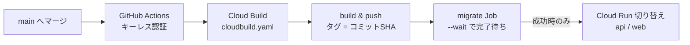

# 企業 × IT人材マッチングサービス — アーキテクチャ設計版

**企業 × IT人材（副業・フリーランスエンジニア）のビジネスマッチングサービスを、 別の設計で再実装するリポジトリ。**

## 作成した背景

リポジトリ [it-matching-service](https://github.com/masa-devx/it-matching-service) を**リファクタ・再設計したらどうなるかを検証する**ために作ったリポジトリ。

MVP 版は機能を出し切ることを優先し、**あえて層を分けずに完成させた**（その判断の記録は [docs/アーキテクチャ.md](docs/アーキテクチャ.md)）。
同じリポジトリでリファクタすると Before の姿が git 履歴の中にしか残らないため、**別リポジトリで再実装し、検証。**

| 要素             | MVP版（Before）              | このリポジトリ（After）               |
| ---------------- | ---------------------------- | ------------------------------------- |
| ルーティング     | `mux.HandleFunc` を手書き    | **生成コードが張る**（oapi-codegen）  |
| ハンドラの型     | `http.ResponseWriter` 直書き | **StrictHandler**（型付き req/res）   |
| 依存の持ち方     | パッケージ変数の `db`        | **main.go で DI**                     |
| DBアクセス       | `database/sql`（手書きSQL）  | **sqlc**（repository 層は作らない）   |
| 認可のロール判定 | 各ハンドラで `if user.Role`  | **パスプレフィックス × ミドルウェア** |
| 一覧の取得       | 全件取得                     | **seek 法ページネーション**           |
| テスト           | 純粋関数のみ（実装の25%）    | **実DBテスト（Tx分離）＋ factories**  |
| API仕様          | 手書きの型（Go / TS で別々） | **TypeSpec → OpenAPI → Go/TS 生成**   |
| 公開             | ローカルのみ                 | **Cloud Run ＋ Cloud Run Job**        |

各判断の詳しい理由（何の事故を構造で防ぐか）と全項目の対比は [設計プラン](docs/後継リポジトリ設計プラン.md) にまとめている。

**実装スコープは4ドメインのみ**（認証＋プロフィール / 案件 / 応募 / eKYC）。
契約・稼働報告・メッセージ・レビューは移植しない——同じパターンの繰り返しで、新しく示せることが少ないため。
機能の量は MVP 版が担い、このリポジトリは**設計を示す**ことに集中する。

## 技術選定

| 領域             | 採用技術                                      | 選定理由                                                              |
| ---------------- | --------------------------------------------- | --------------------------------------------------------------------- |
| モノレポ         | **Turborepo + pnpm workspace**                | Go もタスクグラフに載せ、仕様変更 → 生成 → ビルドを連鎖できる         |
| API 仕様         | **TypeSpec → OpenAPI**                        | 契約の一次情報を1箇所に。生成物はコミットし CI で差分チェック         |
| バックエンド     | **Go + oapi-codegen（StrictHandler）**        | 仕様とのズレがコンパイルエラーになる。ルーティングは生成コードが張る  |
| DB アクセス      | **sqlc**（repository 層なし）                 | SQL を資産として残したまま型安全。`Queries` が repository 相当        |
| マイグレーション | **sql-migrate**                               | Up / Down の履歴管理。本番では Cloud Run Job から同じものを実行       |
| フロントエンド   | **Next.js（App Router）+ orval**              | 型・Fetch Client・Zod を仕様から生成し、手書きの型二重管理を排除      |
| サーバー状態     | **TanStack Query + Server Actions**           | 読み取りは prefetch / Hydration、書き込みはサーバー経由で Go へ       |
| 認証・認可       | **自前 JWT（bcrypt・httpOnly Cookie）**       | トークンをブラウザ JS に触れさせない。認可はパス × ミドルウェアで一律 |
| テスト           | **実DBテスト（pgx.Tx 分離）+ API 統合テスト** | モックしない＝「テストは通るが動かない」を防ぐ                        |
| インフラ         | **Cloud Run + Cloud Run Job + Neon**          | ゼロスケールで安い。migrate はデプロイ列の中で1回だけ実行             |

### 採用と見送りの判断（抜粋）

比較して見送った選択肢と経緯は、**設計判断の記録（ADR: Architecture Decision Record）**として [docs/adr/](docs/adr/README.md) に残している。

| 論点         | 採用                             | 見送り                         | 決め手                                                                                                                                                                 |
| ------------ | -------------------------------- | ------------------------------ | ---------------------------------------------------------------------------------------------------------------------------------------------------------------------- |
| DB アクセス  | sqlc                             | ORM ／ 手書き database/sql     | SQL と実行計画を隠さず、型は生成で守る（手書きは MVP 版で経験済み・Before として比較対象に）                                                                           |
| E2E テスト   | API 統合テスト（実ミドルウェア） | ブラウザ E2E                   | 実際のミドルウェアを通した API テストで「通し」を保証し、壊れやすく遅いブラウザ操作を持たない（[判断の記録](docs/adr/0012-api-integration-tests-over-browser-e2e.md)） |
| フロント構成 | web 1アプリ                      | company / talent の2アプリ分割 | この規模ではロールの境界はルートグループで足りる（[判断の記録](docs/adr/0006-single-frontend-after-only.md)）                                                          |
| 視覚回帰     | 導入見送り（発動条件を明文化）   | Chromatic 等                   | UI の変更頻度がまだ投資に見合わない。導入する条件ごと記録（[判断の記録](docs/adr/0009-defer-visual-regression.md)）                                                    |

## アーキテクチャ設計

```
<repo>/                        ★ Turborepo モノレポ
├─ api-server/                 # Go — internal/{company,talent,shared} の視点→層分割
│  └─ generated/               #   oapi-codegen の生成物（編集禁止・コミットする）
├─ web/                        # Next.js 1アプリ（ロール分岐はルートグループ）
├─ packages/spec/              # TypeSpec（API契約の一次情報）
└─ migrations/ddl/             # sql-migrate
```

- **API 契約は TypeSpec の1箇所で定義**し、OpenAPI 経由で Go（oapi-codegen）と TS（orval）へ同じ型を生成する
- **仕様変更 → 生成 → ビルドを Turborepo のタスクグラフで連鎖**させ、「生成し忘れ」を構造的に無くす

### バックエンド（api-server/）

```
generated/api（生成ルーター） → handler → usecase → sqlc の Queries → PostgreSQL
                                        ↘ shared/domain（遷移表・不変条件）
```

- **「視点 → 層」の2段で分割**する。まず `internal/{company,talent,shared}` と「**誰から見た機能か**」で縦に割り、その中を handler / usecase / validator の層に分ける
- 責務は薄く固定する。**handler は生成インターフェースの実装と詰め替えだけ**、**usecase が業務ロジックとトランザクション境界**、**shared/domain が遷移表・不変条件**（DB にも HTTP にも依存しない純粋な Go）
- **repository 層は作らない**。SQL は `queries/*.sql` に書き、sqlc が生成する `Queries` を usecase からそのまま使う（薄皮の抽象を重ねない）
- 認可はパスで一律に決める。`/company/*` は企業ロール、`/talent/*` は人材ロールをミドルウェアが強制し、**ハンドラにロール判定を書かない**
- `company` ⇔ `talent` の相互 import 禁止・`shared/domain` から infra / generated への import 禁止を **golangci-lint（depguard）で機械的に強制**する

### フロントエンド（web/）

- `app/` は**ルーティングとアクセス制御だけ**。ルートグループ＝認可の境界（company / talent・ログイン要否）として維持し、page.tsx は組み立てに徹する
- 機能の本体は `features/{domain}/` に縦割りし、外部との接点は `external/`（handler → client・server-only）の**1枚の壁**に集約する
- **読み取りは TanStack Query**（RSC で prefetch → Hydration）、**書き込みは Server Actions** の薄いラッパー。トークンは httpOnly Cookie でブラウザ JS に触れさせない
- 型・Fetch Client・Zod スキーマは **orval の生成物から供給**し、手書きの型を二重管理しない
- `features/` → `external/client` の直接 import・`features` 同士の直接依存は **ESLint の import 制約で禁止**する（境界をレビュー頼みにしない）

## デプロイのワークフロー

main へのマージが唯一のデプロイ経路。GitHub Actions は**認証と起動だけの薄い層**に保ち、手順の一次情報は `cloudbuild.yaml` に置く。



- **順序が本体**: build → push → migrate 成功 → サービス切り替え。**migrate が失敗したら旧イメージのまま止まる**＝半端な状態を作らない
- **キーレス認証（WIF: Workload Identity Federation）**: サービスアカウントの鍵ファイルを GitHub に置かない。GitHub が発行するトークンを GCP 側が検証し、受け入れ条件はこのリポジトリのみに絞る
- **イメージタグ＝コミット SHA**: どのコミットが本番にいるかをタグだけで特定できる
- DB は Neon（PostgreSQL）。マイグレーションは API 起動時ではなく **Cloud Run Job で1回だけ**実行する
- 手順・判断・踏んだ罠の記録: [docs/デプロイ.md](docs/デプロイ.md) ／ [web を Cloud Run に載せた判断の記録](docs/adr/0011-web-on-cloud-run.md)

### 参考記事

- [Workload Identity Federation](https://cloud.google.com/iam/docs/workload-identity-federation) — キーレス認証の仕組み（公式）
- [Enabling keyless authentication from GitHub Actions](https://cloud.google.com/blog/products/identity-security/enabling-keyless-authentication-from-github-actions) — GitHub Actions × WIF の設定手順（Google Cloud 公式ブログ）
- [google-github-actions/auth](https://github.com/google-github-actions/auth) — WIF 認証アクションの公式 README
- [Cloud Build 構成ファイル スキーマ](https://cloud.google.com/build/docs/build-config-file-schema) — `cloudbuild.yaml` の書き方（公式）
- [Cloud Run ジョブの作成と実行](https://cloud.google.com/run/docs/create-jobs) — migrate を Job で流す構成（公式）
- [Neon Docs](https://neon.com/docs/introduction) — サーバーレス PostgreSQL（公式）

## ドキュメント

- **[後継リポジトリ設計プラン](docs/後継リポジトリ設計プラン.md)** — 設計の全体像（技術選定・認可設計・テスト戦略・Phase 計画）
- **[設計判断の記録（ADR）](docs/adr/README.md)** — 個々の判断の経緯と、却下した代替案
- [デプロイ](docs/デプロイ.md) — Cloud Run + Neon の構成・手順・CD の設計
- [アーキテクチャ設計書](docs/アーキテクチャ.md) / [web/README.md](web/README.md) — 出発点（MVP 版）の設計記録
- [サービス概要](docs/サービス概要.md) — 何を作っているか（課題・信頼の設計・機能一覧）
- [データ設計（ER図・リレーション）](docs/データ設計.md)
