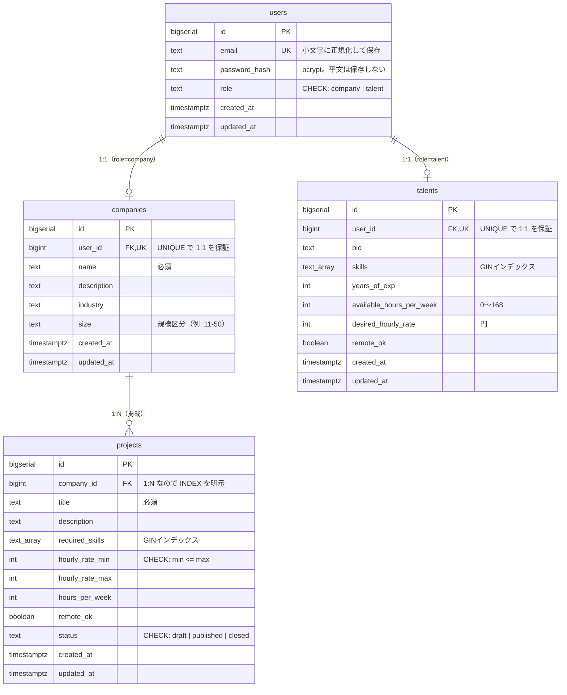
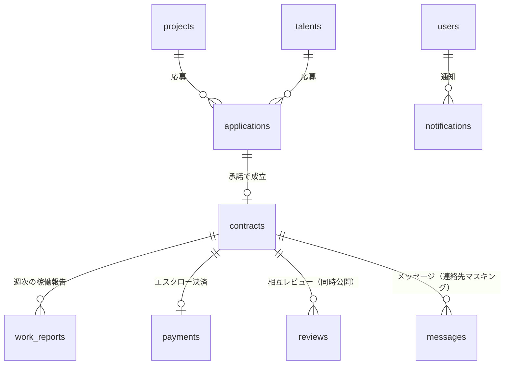

# データ設計（ER図・リレーション）

> スキーマの正は `migrations/ddl/*.sql`。本ドキュメントは全体像と設計判断をまとめたもの。
> テーブルを追加・変更したら、このドキュメントも同じPRで更新する。

## 現在のER図（実装済み）

## リレーション一覧

| 親 | 子 | 関係 | 実現方法 | 削除時 |
| --- | --- | --- | --- | --- |
| users | companies | 1:1 | `user_id` に **UNIQUE**（索引も兼ねる） | CASCADE |
| users | talents | 1:1 | `user_id` に **UNIQUE** | CASCADE |
| companies | projects | 1:N | `company_id` に **INDEX を明示**（UNIQUE を付けない） | CASCADE |

- **1ユーザーは companies か talents のどちらか一方**を持つ（`users.role` で決まる）。DBの制約では「両方持てない」ことまでは縛っておらず、アプリ側の責務としている
- すべて `ON DELETE CASCADE`：ユーザー削除時に孤児レコードを残さない

## インデックス一覧

| テーブル | 索引 | 種類 | 目的 |
| --- | --- | --- | --- |
| users | `users_email_key` | UNIQUE(btree) | ログイン時の検索・重複登録の防止 |
| companies / talents | `*_user_id_key` | UNIQUE(btree) | 1:1保証＋自分のプロフィール取得 |
| talents | `talents_skills_idx` | **GIN** | `skills @> '{Go}'` の包含検索 |
| projects | `projects_company_id_idx` | btree | 「この会社の案件一覧」 |
| projects | `projects_status_created_at_idx` | btree(複合) | `WHERE status='published' ORDER BY created_at DESC`（絞り込みと並べ替えを同時に満たす） |
| projects | `projects_required_skills_idx` | **GIN** | 必須スキルでの案件検索（Phase 2） |

## 設計原則（このリポジトリの規約）

1. **1:1 は UNIQUE・1:N は明示的な INDEX**
   UNIQUE 制約は索引を自動生成するが、1:N の外部キーには索引が作られない。張り忘れると「親に紐づく子の一覧」が全表スキャンになる
2. **未入力は NULL でなく空値**（`''` / `{}` / `0`）
   Go 側のポインタ地獄（`*string`）と、SQL の NULL 比較の罠（`NULL = ''` は true でも false でもない）を避ける。「未入力と空を区別したい」場合のみ NULL を使う
3. **時刻は必ず `TIMESTAMPTZ`**（タイムゾーン付き）
4. **列挙値は CHECK 制約**（ENUM 型は値の追加が重い）。`role` / `status` が該当
5. **業務ルールも CHECK で守る**（`hourly_rate_min <= hourly_rate_max`）。アプリのバリデーションと二重にするのは多層防御
6. **タグ的な多値は配列型 + GIN**（`skills` / `required_skills`）。中間テーブルにしないのは、要素自体が属性を持たないため
7. **列コメント（`COMMENT ON COLUMN`）**は「名前で意味・単位・区分が分からない列」にだけ付ける
8. **スキーマ変更は必ずマイグレーション経由**（psql で直接 DDL を流さない）

## 今後追加予定のテーブル（MVPロードマップ）

| テーブル | Phase | 設計の見どころ |
| --- | --- | --- |
| `applications` | 3 | **状態機械①**（応募→書類→面談→承諾/見送り/取り下げ）。遷移表をコード1か所で定義しテーブル駆動テスト |
| `contracts` | 4 | **状態機械②**（成立→稼働中→検収待ち→完了/中止） |
| `work_reports` | 4 | 週次レポート（提出済/承認/差し戻し） |
| `payments` | 拡張 | **状態機械③**（お金）。`idempotency_key` で Webhook の重複配送に耐える |
| `messages` | 5 | `body`（原文・監査用）と `masked_body`（表示用）を分離 |
| `reviews` | 5 | `submitted_at` と `published_at` を分離し、両者提出まで非公開 |
| `notifications` | 5 | 状態遷移の見逃し防止 |

**業務（contracts）とお金（payments）を別の状態機械に分離し、検収イベントで同期させる**のがこのサービスの設計上の核心。

## クエリ設計のメモ

- **N+1 を作らない**: 一覧で親子を同時に出すときは JOIN 1回（またはIDをまとめて IN 検索）。**ループの中に `db.Query` があったら赤信号**
- **ページネーション**: 当面は LIMIT/OFFSET。件数が増えて深いページが遅くなったら seek 方式（`WHERE created_at < $前ページ末尾`）へ移行する
- SQL は**プレースホルダ必須**・`SELECT *` 禁止（列を明示）
