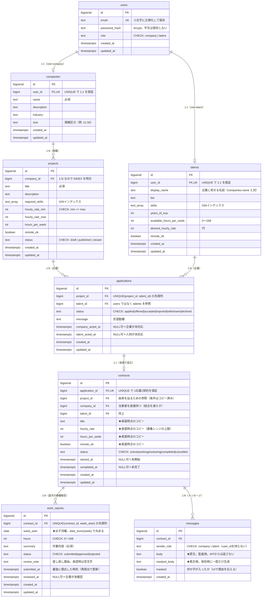
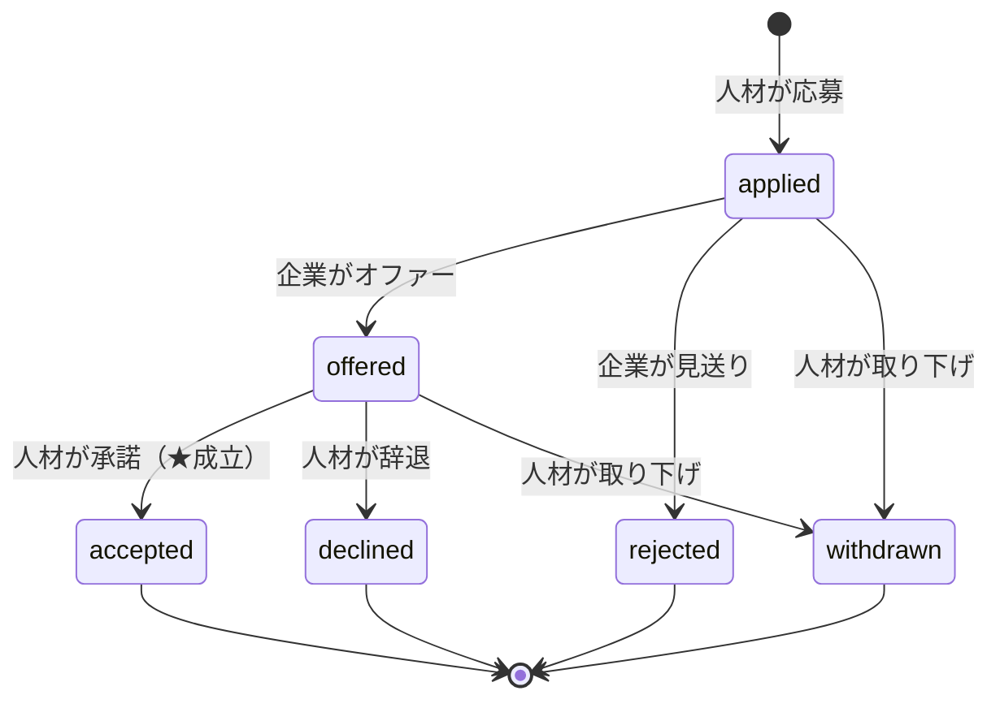
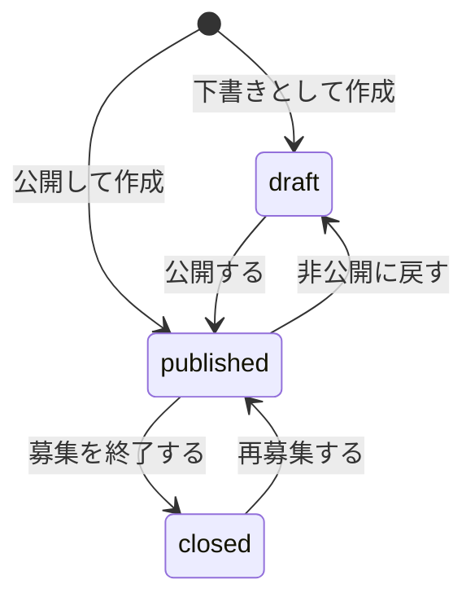
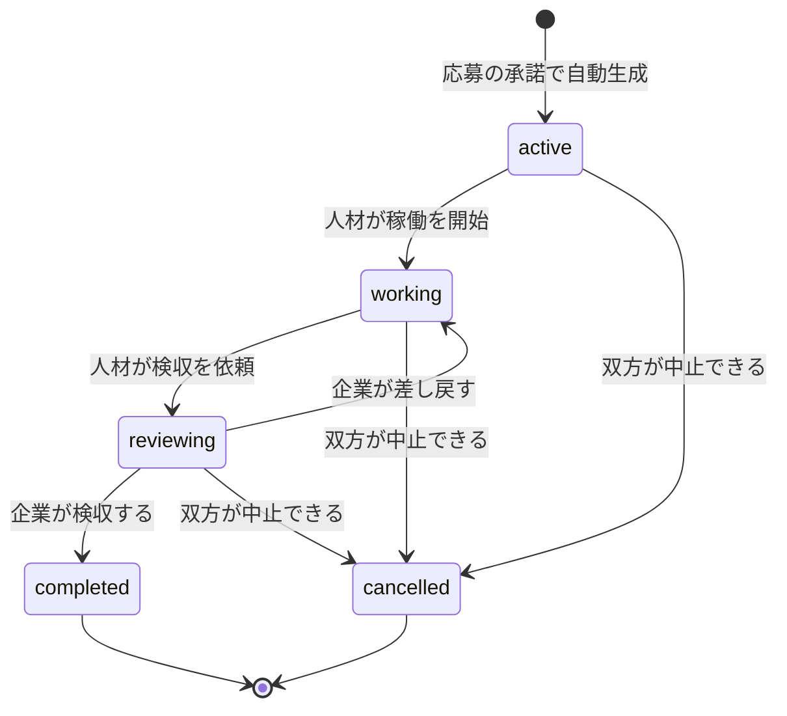
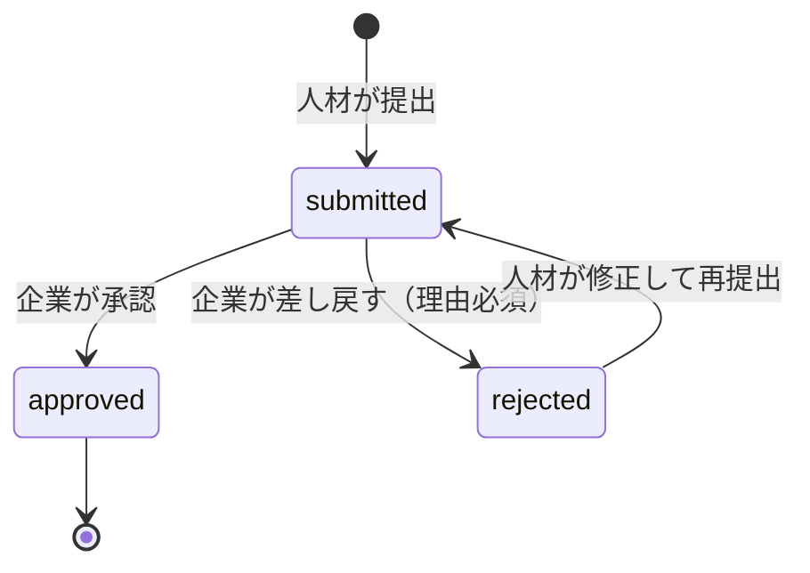
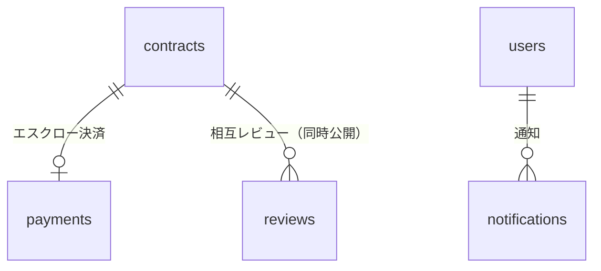

# データ設計（ER図・リレーション）

> スキーマの正は `migrations/ddl/*.sql`。本ドキュメントは全体像と設計判断をまとめたもの。
> テーブルを追加・変更したら、このドキュメントも同じPRで更新する。

## 現在のER図（実装済み）

### 連絡先マスキング（messages）

**このサービスの生命線**。プラットフォーム外で直接契約されると、手数料が入らないだけでなく**トラブル時の保護（エスクロー・稼働報告・レビュー）がすべて効かなくなる**。

- **原文（`body`）と表示用（`masked_body`）を両方持つ**
  - `body` は**監査・紛争時の証跡**として残すが、**APIからは返さない**（返さなければ漏れない）
  - `masked_body` は**保存時に一度だけ生成**する。表示のたび計算すると、正規表現を改善したときに**過去のメッセージの見え方まで変わり**、「あのとき相手に何が見えていたか」を再現できなくなる
- **送信者は `user_id` ではなくロール**。契約が当事者を持つため、ロールが決まれば送信者が一意に定まる。`user_id` だと「当事者でないID」が入る余地が生まれる
- 索引は `(contract_id, created_at)` の**昇順**（会話は上から下へ読む）。稼働報告が DESC なのと対照的
- 検出対象は**メール・電話・URL の3種類**。完璧な検出は不可能なので「簡単にはできなくする」ことを目標とし、**誤検知を減らす方向**に倒している（詳細: `docs/バックエンド.md`）

### 稼働報告の週の持ち方（work_reports）

`week_start` は**週の開始日（必ず月曜）**を DATE で持つ。

- **ISO週番号の文字列（`2026-W32`）にしない**——12/29〜1/4 は同じ週なのに年が変わるため、年跨ぎで表現が揺れ、並べ替えも破綻する
- 日付なら比較演算子がそのまま使える（`WHERE week_start >= '2026-08-01'`）
- **丸めはDB側で** `date_trunc('week', $1::date)::date`（PostgreSQL の week は ISO週＝月曜始まり）。クライアントの週計算を信用せず、保存する値をサーバーで確定させる
- `UNIQUE (contract_id, week_start)` で**同じ週の二重提出を拒否**する（#83 の二重応募と同じ形）

### 条件のスナップショット（contracts）

契約の `title` / `hourly_rate` / `hours_per_week` / `remote_ok` は、**案件を参照せず値でコピー**している。

- 案件は掲載後に編集できる（#97）ため、**参照のままだと契約成立後に単価を書き換えられる**
- `projects.hourly_rate_max` は「**今の募集条件**」、`contracts.hourly_rate` は「**あのとき合意した条件**」＝**別の事実**なので、別の列に持つのが正しい（正規化違反ではない）
- 確定した合意（契約・注文・請求）は値でコピーするのが定石。ECの注文明細に商品名・価格をコピーするのと同じ理屈
- 由来は `project_id` で辿れる（表示・監査用）。この列に `ON DELETE CASCADE` は付けない——**契約が残っているのに案件が消える**のを防ぐため

### 状態機械①（applications.status）

**`accepted` に入る経路が「offered から・人材の操作」の1本しかない**のがダブルオプトイン。企業は `offered` までしか進められず、成立させる権限を構造的に持たない。

遷移の定義は `api/application_status.go` の **`applicationTransitions`（表）が唯一の真実**。許可だけを列挙し、終端状態は表に `from` として現れないため自動的に遷移不可になる（ホワイトリスト方式）。

### 掲載状態（projects.status）

- **終端状態が無い**（`closed` からも `published` に戻せる）。採用が流れた場合の再募集や、契約が中止されたときの募集再開に対応するため
- `draft → closed` / `closed → draft` は許可しない（「一度も公開していない案件を終了する」「終了した案件を下書きに戻す」は意味が不明瞭）
- 操作できるのは**常に所有企業だけ**なので、遷移表は `map[遷移]bool` で足りる（応募の表はロールを持つ）
- 定義は `api/project_status.go` の **`projectTransitions`**
- **番号を振らない**: 番号付きの状態機械（①選考 / ②契約 / ③決済）は取引の進行を表す本筋。掲載状態は案件の公開範囲を切り替える**補助的なもの**で、性質が違う

### 状態機械②（contracts.status）

- **`reviewing → working`（差し戻し）がこのプロジェクト初の「戻る遷移」**。何度でも往復しうるため、状態が単調に進む前提の処理を書いてはいけない
  - 例: `started_at` を working に入るたび上書きすると、差し戻しのたび開始日がずれる → `COALESCE(started_at, now())` で既存値を優先する
- **`reviewing → completed` は企業だけ**。人材が自分で完了させられないことが、「成果を確認してから完了する」という**検収の意味そのもの**
- **中止は3つの状態から、双方が実行できる**。ただし `completed` からは不可——検収が済んだ取引を後から無かったことにはしない
- 定義は `api/contract_status.go` の **`contractTransitions`**。中止だけが2ロールから実行できるため、値は**ロールの集合**（`[]string`）

### 稼働報告の状態（work_reports.status）

- **契約の検収とは別物**。契約の `reviewing → completed` は「仕事全体の確認」、こちらは「その週の作業内容の確認」
- **確認するのは企業だけ**。人材が自分の報告を承認できると、稼働報告が「第三者に確認された記録」ではなく単なる自己申告に落ちる
- **`approved` は終端**。いったん承認した報告を覆せるようにすると、「承認済み＝確定した実績」という前提が崩れ、報酬計算の根拠にできなくなる
- `rejected → submitted`（再提出）は**戻る遷移**。契約の差し戻しと対になっている
- 定義は `api/work_report_status.go` の **`workReportTransitions`**

## リレーション一覧

| 親 | 子 | 関係 | 実現方法 | 削除時 |
| --- | --- | --- | --- | --- |
| users | companies | 1:1 | `user_id` に **UNIQUE**（索引も兼ねる） | CASCADE |
| users | talents | 1:1 | `user_id` に **UNIQUE** | CASCADE |
| companies | projects | 1:N | `company_id` に **INDEX を明示**（UNIQUE を付けない） | CASCADE |
| projects | applications | 1:N | `UNIQUE(project_id, talent_id)` の**先頭列**が索引を兼ねる | CASCADE |
| talents | applications | 1:N | `talent_id` に **INDEX を明示**（複合索引の左端規則で単独では引けないため） | CASCADE |
| applications | contracts | **1:1** | `application_id` に **UNIQUE**（1応募1契約をDBが保証） | CASCADE |
| projects | contracts | 1:N | 由来の参照のみ（条件はコピー済み） | **RESTRICT**（既定・契約が残る案件は消せない） |
| companies / talents | contracts | 1:N | 当事者を直接持ち、`(当事者, created_at DESC)` の複合索引 | CASCADE |
| contracts | work_reports | 1:N | `UNIQUE(contract_id, week_start)` で**同じ週の二重提出を拒否** | CASCADE |
| contracts | messages | 1:N | `(contract_id, created_at)` の昇順索引（会話は古い順） | CASCADE |

- **1ユーザーは companies か talents のどちらか一方**を持つ（`users.role` で決まる）。DBの制約では「両方持てない」ことまでは縛っておらず、アプリ側の責務としている
- すべて `ON DELETE CASCADE`：ユーザー削除時に孤児レコードを残さない
- **`applications` は交差テーブル**（projects × talents）だが、status・志望動機・時刻という固有の属性を持つため、単なる中間テーブルではなく**業務上の実体**として扱う

## インデックス一覧

| テーブル | 索引 | 種類 | 目的 |
| --- | --- | --- | --- |
| users | `users_email_key` | UNIQUE(btree) | ログイン時の検索・重複登録の防止 |
| companies / talents | `*_user_id_key` | UNIQUE(btree) | 1:1保証＋自分のプロフィール取得 |
| talents | `talents_skills_idx` | **GIN** | `skills @> '{Go}'` の包含検索 |
| projects | `projects_company_id_idx` | btree | 「この会社の案件一覧」 |
| projects | `projects_status_created_at_idx` | btree(複合) | `WHERE status='published' ORDER BY created_at DESC`（絞り込みと並べ替えを同時に満たす） |
| projects | `projects_required_skills_idx` | **GIN** | 必須スキルでの案件検索（Phase 2） |
| applications | `applications_project_talent_key` | **UNIQUE**(複合) | **二重応募の禁止**＋「この案件への応募一覧」 |
| applications | `applications_talent_id_idx` | btree | 「自分の応募履歴」（上の複合索引は先頭列が違うため効かない） |
| applications | `applications_project_status_idx` | btree(複合) | 企業の応募者管理（案件×選考状態での絞り込み） |
| contracts | `contracts_application_id_key` | **UNIQUE**(btree) | **1応募1契約の保証** |
| contracts | `contracts_company_id_created_at_idx` | btree(複合) | 「自社の契約を新しい順に」（絞り込みと並べ替えを同時に満たす） |
| contracts | `contracts_talent_id_created_at_idx` | btree(複合) | 「自分の契約を新しい順に」（左端規則のため当事者ごとに1本ずつ必要） |
| contracts | `contracts_status_idx` | btree | 稼働中・検収待ちでの絞り込み |
| work_reports | `work_reports_contract_week_key` | **UNIQUE**(複合) | **同じ週の二重提出を拒否**＋「この契約の報告」 |
| work_reports | `work_reports_contract_week_desc_idx` | btree(複合) | 一覧を新しい週から表示する（昇順索引の逆読みでも足りるが、用途を明示） |
| work_reports | `work_reports_status_idx` | btree | 未確認の報告がある契約を数える |
| messages | `messages_contract_created_at_idx` | btree(複合) | 「この契約の会話を古い順に」 |

## 設計原則（このリポジトリの規約）

1. **1:1 は UNIQUE・1:N は明示的な INDEX**
   UNIQUE 制約は索引を自動生成するが、1:N の外部キーには索引が作られない。張り忘れると「親に紐づく子の一覧」が全表スキャンになる
2. **未入力は NULL でなく空値**（`''` / `{}` / `0`）
   Go 側のポインタ地獄（`*string`）と、SQL の NULL 比較の罠（`NULL = ''` は true でも false でもない）を避ける。「未入力と空を区別したい」場合のみ NULL を使う
3. **時刻は必ず `TIMESTAMPTZ`**（タイムゾーン付き）
4. **列挙値は CHECK 制約**（ENUM 型は値の追加が重い）。`role` / `status` が該当
5. **業務ルールも CHECK で守る**（`hourly_rate_min <= hourly_rate_max`）。アプリのバリデーションと二重にするのは多層防御
6. **タグ的な多値は配列型 + GIN**（`skills` / `required_skills`）。中間テーブルにしないのは、要素自体が属性を持たないため
7. **列コメント（`COMMENT ON COLUMN`）**は「名前で意味・単位・区分が分からない列」にだけ付ける
8. **スキーマ変更は必ずマイグレーション経由**（psql で直接 DDL を流さない）

## 今後追加予定のテーブル（MVPロードマップ）

| テーブル | Phase | 設計の見どころ |
| --- | --- | --- |
| `payments` | 拡張 | **状態機械③**（お金）。`idempotency_key` で Webhook の重複配送に耐える |
| `reviews` | 5 | `submitted_at` と `published_at` を分離し、両者提出まで非公開 |
| `notifications` | 5 | 状態遷移の見逃し防止 |

**業務（contracts）とお金（payments）を別の状態機械に分離し、検収イベントで同期させる**のがこのサービスの設計上の核心。

## クエリ設計のメモ

- **N+1 を作らない**: 一覧で親子を同時に出すときは JOIN 1回（またはIDをまとめて IN 検索）。**ループの中に `db.Query` があったら赤信号**
- **ページネーション**: 当面は LIMIT/OFFSET。件数が増えて深いページが遅くなったら seek 方式（`WHERE created_at < $前ページ末尾`）へ移行する
- SQL は**プレースホルダ必須**・`SELECT *` 禁止（列を明示）
- **視点が違えばクエリも型も分ける**: 同じ `applications` でも、人材は「どの案件に応募したか」（→ projects/companies を結合）、企業は「誰が応募してきたか」（→ talents を結合）を見る。共通化するとどちらにとっても使いにくい形になる
- **所有チェックはクエリに埋め込む**: `WHERE t.user_id = $1` のように**検証済みトークン由来のIDで絞る**。取得してからアプリで判定する形は、1箇所書き忘れると権限昇格になる
  - ただし「他人のリソースを指定した」ことを**404として明示したい**場合は、先に所有を確認する別クエリを置く（企業の応募者一覧がこの形）
- **返す必要のない個人情報はSELECTしない**: 応募者一覧に `users.email` は含めない（連絡先マスキング＝直接取引の防止）。**APIが返さなければフロントの実装ミスでも漏れない**
- **JOIN の使い分け**（詳細: `docs/DB.md`）:
  - **相手が必ず存在するなら INNER**（外部キーが NOT NULL）／**0件がありうるなら LEFT**
  - 同じクエリ内で使い分ける。例（企業向け案件一覧）: `companies` は INNER（会社は必ずある）・`applications` は LEFT（応募は0件かもしれない）
  - **LEFT JOIN で件数を数えるときは `count(列名)`**。`count(*)` は NULL で埋まった行を1件と数えるため、**0件が1件になる**
  - 複数の集計は **`count(...) FILTER (WHERE ...)`** で1回のスキャンにまとめる
- **件数のクエリでは表示用の結合を流用しない**: JOIN は行を増やすため、応募3件の案件が3行に数えられて総件数が水増しされる。「何を1件と数えるのか」で FROM を分ける
- **実際に使われている索引の実測**（EXPLAIN で確認済み）:

  | クエリ | 使われる索引 | 実測 |
  | --- | --- | --- |
  | 人材の応募履歴 | `applications_talent_id_idx` | — |
  | 企業の応募者一覧（状態絞り込み） | `applications_project_status_idx`（2条件とも Index Cond に入る） | — |
  | 企業向け案件一覧（応募件数の集計） | `projects_company_id_idx` | **3.7ms**（1社5000件の最悪ケース） |
  | 契約一覧（稼働報告の集計） | `contracts_company_id_created_at_idx` / `work_reports_contract_week_desc_idx` | — |
